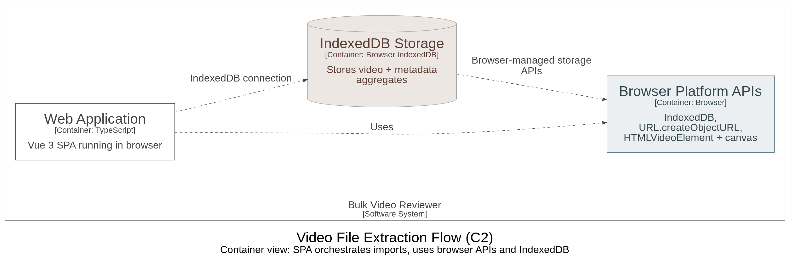
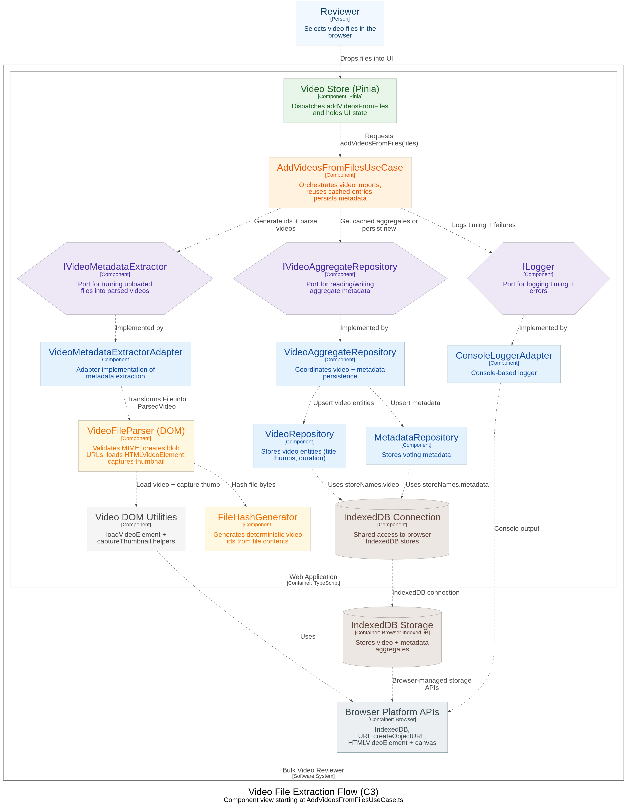

# bulk-video-review

See [`AGENTS.md`](AGENTS.md) for contributor guidelines.

## Video File Extraction Diagrams

Generated from the Structurizr DSL in `docs/structurizr/` (defaults to `video-file-extraction.dsl` unless you set `STRUCTURIZR_WORKSPACE`). Outputs land in `docs/structurizr/diagrams/*.png`:

### C1 - System


### C2 - Container



### C3 - Component



Run `npm run diagram:video` after ensuring Structurizr CLI and Graphviz (`dot`) are available. The devcontainer installs both via Dockerfile; otherwise set `STRUCTURIZR_CLI` (or `STRUCTURIZR_CLI_SH`) to your local install.

---

## Project Setup

```sh
npm install
```

## Worktree Workflow

Create a bootstrapped worktree with:

```sh
npm run worktree:add -- <branch>
```

This creates `.worktrees/<branch-name>` by default, links the main workspace `node_modules`, and links any repo-root `.env` or `.env.*` files into the new worktree.

To bootstrap an existing worktree from the main checkout:

```sh
npm run worktree:bootstrap -- .worktrees/<branch-name>
```

After bootstrap, run the worktree-aware dev helpers from inside the worktree:

```sh
npm run dev:worktree
npm run dev:status
npm run dev:stop
```

### Compile and Hot-Reload for Development

```sh
npm run dev
```

### Type-Check, Compile and Minify for Production

```sh
npm run build
```

### Run Unit Tests with [Vitest](https://vitest.dev/)

```sh
npm run test:unit
```

### Run End-to-End Tests with [Cypress](https://www.cypress.io/)

```sh
npm run test:e2e:dev
```

This runs the end-to-end tests against the Vite development server.

It is much faster than the production build.

But it's still recommended to test the production build with `test:e2e` before deploying (e.g. in CI environments):

```sh
npm run build
npm run test:e2e
```

### Lint with [ESLint](https://eslint.org/)

```sh
npm run lint
```

## Deploying

Deploys to Github Pages

```sh
npm run deploy
```
